# SPR X-Ray Gender Prediction 

This notebook will use SPR X-Ray data from Kaggle, which contains
* Training data of 10.7k chest x-ray images with labels regarding genders and age
* Test data of 11.7k images without labels, that are supposed to be used for the submission of the results in kaggle

https://www.kaggle.com/datasets/felipekitamura/spr-x-ray-age-and-gender-dataset

**In this project, will focus on creating a model which predicts person's gender based on chest X-Ray image.**

**Table of contents**

1. [Setup](#Setup)
    
2. [Basic Data exploration & preparation](#Basic-data-exploration-&-preparation)

3. [Models](#Models)<br>
    a. [Simple CNN Model](#Simple-CNN-Model)<br>
    b. [EfficientNet B3 Model](#EfficientNet-B3-Model)<br>
    c. [DenseNet121 Model](#DenseNet121-Model)<br>
    d. [Vision Transformer Model](#Vision-Transformer-Model)<br>
    
4. [Model Evaluation](#Model-Evaluation)<br>
    a. [Defining functions for evaluation](#Defining-functions-for-evaluation)<br>
    b. [Model Comparison](#Model-Comparison)<br>
    c. [Conclusions](#Conclusions-regarding-model-evaluation)<br>
    
5. [Fine Tuning](#Fine-Tuning)<br>
    a. [EfficientNet](#Efficientnet)<br>
    b. [DenseNet](#Densenet)<br>
    c. [Overall Conclusions](#Conclusions)<br>


# Setup

## Installs


```python
import sys
!{sys.executable} -m pip install vit-keras
!{sys.executable} -m pip install opencv-python
!{sys.executable} -m pip install tensorflow_hub
```

    Collecting vit-keras
      Downloading vit_keras-0.1.0-py3-none-any.whl (24 kB)
    Collecting validators
      Downloading validators-0.20.0.tar.gz (30 kB)
      Preparing metadata (setup.py) ... [?25ldone
    [?25hRequirement already satisfied: scipy in /opt/conda/lib/python3.7/site-packages (from vit-keras) (1.7.3)
    Requirement already satisfied: numpy<1.23.0,>=1.16.5 in /opt/conda/lib/python3.7/site-packages (from scipy->vit-keras) (1.21.6)
    Requirement already satisfied: decorator>=3.4.0 in /opt/conda/lib/python3.7/site-packages (from validators->vit-keras) (5.1.1)
    Building wheels for collected packages: validators
      Building wheel for validators (setup.py) ... [?25ldone
    [?25h  Created wheel for validators: filename=validators-0.20.0-py3-none-any.whl size=19581 sha256=7afaa2bcd26033ffdd225ea208ce1d02ab4d823e6fb1a6e714597424284d297a
      Stored in directory: /root/.cache/pip/wheels/3d/7c/f1/f87f51d07a2513aa0fb128d5eb504da1fcef9c87475d9eef64
    Successfully built validators
    Installing collected packages: validators, vit-keras
    Successfully installed validators-0.20.0 vit-keras-0.1.0
    WARNING: Running pip as the 'root' user can result in broken permissions and conflicting behaviour with the system package manager. It is recommended to use a virtual environment instead: https://pip.pypa.io/warnings/venv
    Requirement already satisfied: opencv-python in /opt/conda/lib/python3.7/site-packages (4.5.4.60)
    Requirement already satisfied: numpy>=1.14.5 in /opt/conda/lib/python3.7/site-packages (from opencv-python) (1.21.6)
    WARNING: Running pip as the 'root' user can result in broken permissions and conflicting behaviour with the system package manager. It is recommended to use a virtual environment instead: https://pip.pypa.io/warnings/venv
    Requirement already satisfied: tensorflow_hub in /opt/conda/lib/python3.7/site-packages (0.12.0)
    Requirement already satisfied: numpy>=1.12.0 in /opt/conda/lib/python3.7/site-packages (from tensorflow_hub) (1.21.6)
    Requirement already satisfied: protobuf>=3.8.0 in /opt/conda/lib/python3.7/site-packages (from tensorflow_hub) (3.20.3)
    WARNING: Running pip as the 'root' user can result in broken permissions and conflicting behaviour with the system package manager. It is recommended to use a virtual environment instead: https://pip.pypa.io/warnings/venv
    

## Imports


```python
import numpy as np
import pandas as pd 
from matplotlib import pyplot as plt
import matplotlib.ticker as mtick
import matplotlib.image as mpimg
import seaborn as sns

import tensorflow as tf
import tensorflow_hub as hub
from tensorflow.keras import layers, Sequential
from tensorflow.keras.utils import plot_model
from tensorflow.keras.layers import Dense, Dropout, Flatten, Rescaling
from tensorflow.keras.models import load_model

from vit_keras import vit

import sklearn
from sklearn.model_selection import train_test_split
from sklearn.metrics import accuracy_score, f1_score
from sklearn.metrics import confusion_matrix

import os
from glob import glob
import time
import random
import cv2

# Old locations when I was running this from my PC
# train_folder = os.path.abspath(os.path.join('.', 'kaggle/train/'))
# test_folder = os.path.abspath(os.path.join('.', 'kaggle/test/'))
# train_age_csv = 'train_age.csv'
# train_gender_csv = 'train_gender.csv'

# Locations of csv files describing the images + labels
test_folder = '/kaggle/input/spr-x-ray-age-and-gender-dataset/kaggle/kaggle/test/'
train_folder = '/kaggle/input/spr-x-ray-age-and-gender-dataset/kaggle/kaggle/train/'

train_age_csv = '/kaggle/input/spr-x-ray-age-and-gender-dataset/train_age.csv'
train_gender_csv = '/kaggle/input/spr-x-ray-age-and-gender-dataset/train_gender.csv'

# loading training data labels
df_age = pd.read_csv(train_age_csv)
df_gender = pd.read_csv(train_gender_csv)
```

## Config
**Defining a config of commonly called values used for training/setup of our models**

Please note that even though our images are greyscale images, we call img_size as (224, 224, 3) due to many of transfer models that we're using have 3 channel input.
* There is merit to either modify the model to be able to handle greyscale input or to modify the image to a 3 channel input. However, based on the following article, I decided to just load images with 3 channels. https://towardsdatascience.com/transfer-learning-on-greyscale-images-how-to-fine-tune-pretrained-models-on-black-and-white-9a5150755c7a


```python
class CFG:
    epochs = 25
    batch_size = 32
    seed = 123
    height = 224
    width = 224
    img_size = (224, 224, 3)
```

## Functions

Defining some functions that will help us with getting labels and visualizing our images.


```python
# Function to visualize data

# Get image id, age & gender based on image path
# (When running from my PC the split string was '\\' because the path structure was different)
def get_id(path):
    return path.split('/')[-1].replace('.png', '')

def get_age(path):
    return df_age.loc[int(get_id(path)), 'age']

def get_gender(path):
    return df_gender.loc[int(get_id(path)), 'gender']

# Plot a sample of images
def plot_images(filenames, num_rows, num_cols): 
    fig, axs = plt.subplots(num_rows, num_cols, figsize=(num_rows*2,num_cols*2))
    axs = axs.ravel()
    for i in range(num_rows * num_cols):
        if i < len(filenames):
            img = mpimg.imread(filenames[i])
            axs[i].imshow(img)
            axs[i].set_title("#" + get_id(filenames[i]).lstrip('0') + " " + ("Male" if get_gender(filenames[i]) else "Female") + " " + str(get_age(filenames[i])) + "yo")
            axs[i].axis('off')
        else:
            axs[i].axis('off')

    plt.tight_layout()
    plt.show()
```

# Basic data exploration & preparation


```python
#get training data size
print(f'Total train set image number: {len(df_gender)}')
```

    Total train set image number: 10702
    


```python
#plot a chart of gender breakdown (0 - female, 1 - male)
df_gender["gender"].value_counts().plot.barh(title='Gender breakdown')
```


    <AxesSubplot:title={'center':'Gender breakdown'}>


    
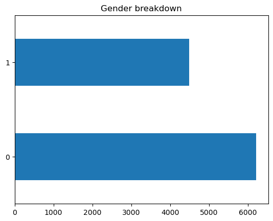
    


**There are more Female X-rays in our datasets but the difference shouldn't impact our model significantly. We should first see how the models perform on dataset with the original distribution of classes before we consider any under/oversampling.**


```python
# Plot a histogram to see the age distribution
df_age["age"].plot.hist(title='Age histogram' , bins=10)
```


    <AxesSubplot:title={'center':'Age histogram'}, ylabel='Frequency'>


    
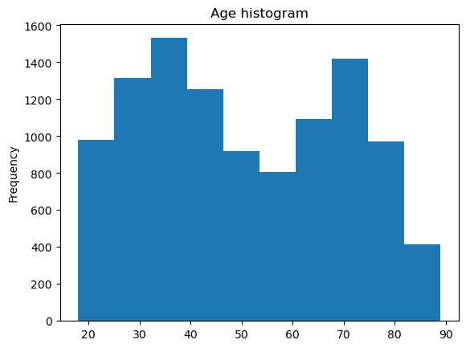
    


**Age distribution looks bimodal with peaks between 30-40 and around 70 years old.**

**For the purpose of this document we will focus on gender classification**


```python
# Plot sample images with their labels
train_files = glob(train_folder + "*.png")
random.shuffle(train_files)
plot_images(train_files, 4, 4)
```


    
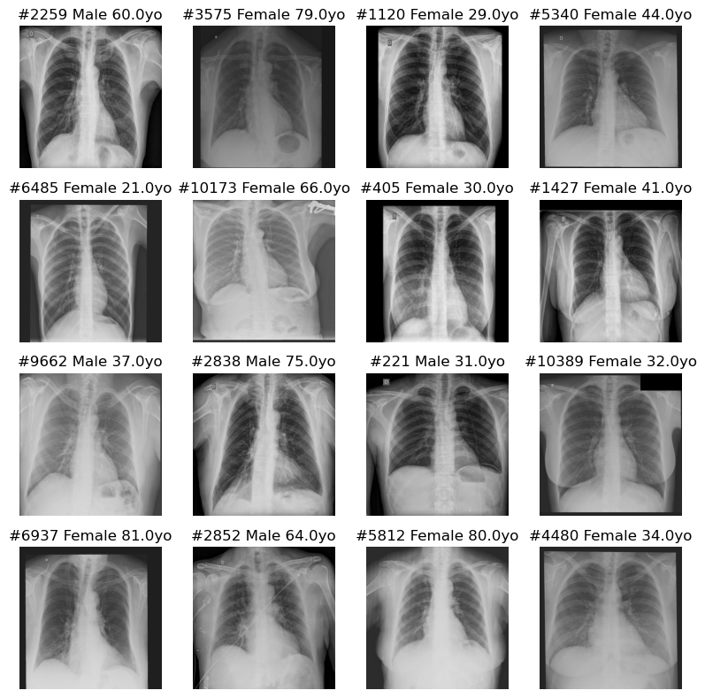
    


```python
# Checking the size of images
im_gray = cv2.imread(train_folder+'/000000.png', cv2.IMREAD_GRAYSCALE)
h, w = im_gray.shape
print('width: ', w)
print('height:', h)
```

    width:  1024
    height: 1024
    

**All images are forced into a resolution of 1024 x 1024 pixels. For scans that are non-square shape, a black border has been added around the image (e.g., see the image #6485 above)**

## Create Pandas DataFrames for paths and labels


```python
def build_df(image_paths):
    # Create dataframe
    paths=[]
    labels=[]
    for path in image_paths:
        paths.append(path)
        labels.append(get_gender(path))
        
    df = pd.DataFrame({'image_path':paths,
                       'label': labels})
    return df


train_files = glob(train_folder + "/*.png")
train_df=build_df(train_files)
train_df["gender"] = ['male' if x == 1 else 'female' for x in train_df['label']]
train_df.head(5)
```


<div>
<style scoped>
    .dataframe tbody tr th:only-of-type {
        vertical-align: middle;
    }

    .dataframe tbody tr th {
        vertical-align: top;
    }

    .dataframe thead th {
        text-align: right;
    }
</style>
<table border="1" class="dataframe">
  <thead>
    <tr style="text-align: right;">
      <th></th>
      <th>image_path</th>
      <th>label</th>
      <th>gender</th>
    </tr>
  </thead>
  <tbody>
    <tr>
      <th>0</th>
      <td>/kaggle/input/spr-x-ray-age-and-gender-dataset...</td>
      <td>1</td>
      <td>male</td>
    </tr>
    <tr>
      <th>1</th>
      <td>/kaggle/input/spr-x-ray-age-and-gender-dataset...</td>
      <td>0</td>
      <td>female</td>
    </tr>
    <tr>
      <th>2</th>
      <td>/kaggle/input/spr-x-ray-age-and-gender-dataset...</td>
      <td>0</td>
      <td>female</td>
    </tr>
    <tr>
      <th>3</th>
      <td>/kaggle/input/spr-x-ray-age-and-gender-dataset...</td>
      <td>0</td>
      <td>female</td>
    </tr>
    <tr>
      <th>4</th>
      <td>/kaggle/input/spr-x-ray-age-and-gender-dataset...</td>
      <td>0</td>
      <td>female</td>
    </tr>
  </tbody>
</table>
</div>


## Create Train & Test Splits


```python
# Creating an image load function based on the path input
# It will later be used in our tf.data pipeline

def load_image(image_path):
    # Read and decode our image
    image = tf.io.read_file(image_path)
    image = tf.io.decode_png(image, channels=3)
    
    # Resizing
    image = tf.image.resize(image, [CFG.height, CFG.width],
                            method='bilinear')
    
    # Convert to float32 and normalize pixel values
    image = tf.cast(image, tf.float32)/255.
    
    # Return image
    return image

# Function to view one sample image
def view_sample(image, label, color_map='gray', fig_size=(4, 5)):
    plt.figure(figsize=fig_size)
    plt.imshow(image, cmap = 'gray')
    plt.title(f'Label: {label}', fontsize=16)
    return

# Select random sample from train_df
idx = random.sample(train_df.index.to_list(), 1)[0]

# Load the random sample and label
sample_image, sample_label = load_image(train_df.image_path[idx]), train_df.gender[idx]

# View the random sample
view_sample(sample_image, sample_label)
```


    
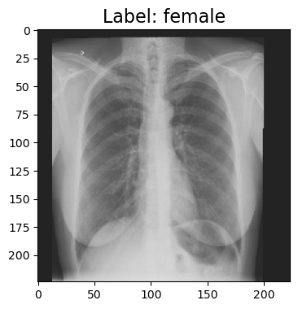
    


```python
# Create Train/Val split with Training Set
train_split_idx, test_split_idx, _, _ = train_test_split(train_df.index, 
                                                        train_df.label, 
                                                        train_size=0.9,
                                                        test_size=0.1,
                                                        stratify=train_df.label,
                                                        random_state=CFG.seed)


# Get new training and validation data
train_new_df = train_df.iloc[train_split_idx].reset_index(drop=True)

#Because we don't have a separate labelled test data (the competition is ongoing), we further split the train data into train and validation
train_df_final = train_new_df.sample(frac=0.9)
val_df = train_new_df.drop(train_df_final.index)
test_df = train_df.iloc[test_split_idx].reset_index(drop=True)

# View shapes
train_df_final.shape, val_df.shape, test_df.shape
```


    ((8668, 3), (963, 3), (1071, 3))


We have split our training dataframes into train, validation & test and have:
* 8668 training samples
* 963 validation samples
* 1071 test samples

Let's check if distributions of labels in these datasets is consistent with the overall distribution:


```python
fig, (ax1, ax2) = plt.subplots(2, figsize=(7, 5))


# Train Set Distribution
ax1.set_title('Train Set Distribution')
train_new_distribution = train_new_df['label'].value_counts().sort_values()
sns.barplot(x=train_new_distribution.values,
            y=list(train_new_distribution.keys()),
            orient="h",
            ax=ax1)


fig.tight_layout(pad=4)

# Validation Set Labels Distribution
ax2.set_title('Validation Set Labels Distribution')
val_distribution = val_df['label'].value_counts().sort_values()
sns.barplot(x=val_distribution.values,
            y=list(val_distribution.keys()),
            orient="h",
            ax=ax2);

```


    
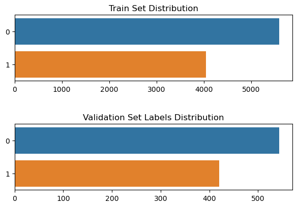
    


Distributions are relatively similar between train and validation data, which is important for training our models

## Data Augmentation Layer

We will add a data augmentation layer to our pipeline, which will hopefully help with training.

Augmentations that we've selected include:
* Horizontal flip of the image
* Random zoom of the image (hopefully this will help a little bit with the images that have a black border)


```python
# Build augmentation layer
# Layer to randomly flip some images in a horizontal manner
# Layer to add slight random zoom to the images 

augmentation_layer = Sequential([
    layers.RandomFlip(mode='horizontal', seed=CFG.seed),
    layers.RandomZoom(height_factor=(-0.1, 0.1), width_factor=(-0.1, 0.1), seed=CFG.seed),
], name='augmentation_layer')

```


```python
# show an example sample image vs. augmented image
fig, (ax1, ax2) = plt.subplots(1, 2, figsize=(10, 7))

# View Original Image
ax1.set_title('Original Image')
ax1.imshow(sample_image, cmap = 'gray');

# View Augmented Image
ax2.set_title('Augmented Image')
ax2.imshow(augmentation_layer(sample_image), cmap = 'gray');
```


    
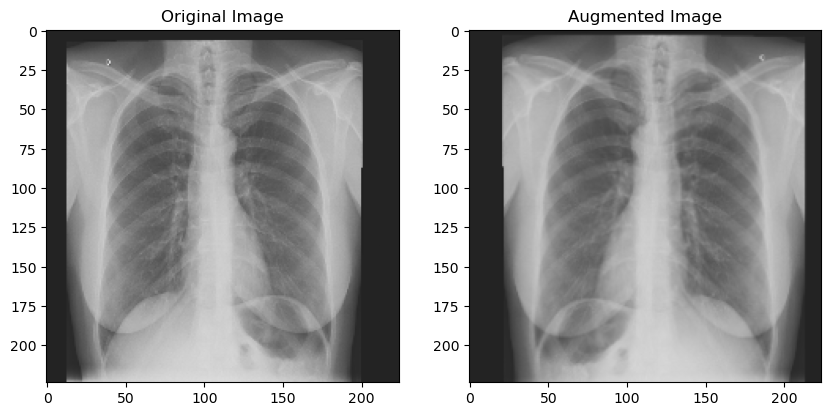
    


As we can see, the augmented image is flipped in a horizontal manner and also zoomed in slightly.

## Defining and creating data input pipelines

Given our dataset's large size (19GB total size), we want to ensure that training time is optimized. That's why we will define a tf.data pipeline to load, preprocess and feed our data in an optimal manner into the model during training. 


```python
# In the pipeline we'll need to encode our labels into one-hot tensors 
def encode_labels(labels, encode_depth=2):
    return tf.one_hot(labels, depth=encode_depth).numpy()


#Documentation regarding optimizing a tf.data pipeline:
#https://www.tensorflow.org/guide/data_performance

def create_pipeline(df, load_function, augmentation = False, prefetch = False):
    
    #getting image paths from our dataframe
    image_paths = df.image_path
    
    #getting labels from our dataframe
    image_labels = encode_labels(df.label)
    
    #create tensorflow dataset
    data = tf.data.Dataset.from_tensor_slices((image_paths,image_labels))
    
    #Defining tf.data.AUTOTUNE, which will prompt the tf.data runtime to tune a value dynamically at runtime.
    #For example it can delegate the decision about what level of parallelism to use in the pipeline 
    # (as seen below with setting num_parallel_calls = AUTOTUNE)
    AUTOTUNE = tf.data.AUTOTUNE
    
    #mapping the function that loads images, which we have defined earlier in the notebook
    data = (data
           .map(lambda x, y: (load_function(x), y), num_parallel_calls = AUTOTUNE)
           )
    
    #mapping the augmentation layer (will only be used for training data)
    if augmentation:
        data = data.map(lambda x, y: (augmentation_layer(x), y), num_parallel_calls = AUTOTUNE)
    else:
        None
        
    data = (data
           .cache()
           .batch(CFG.batch_size)           
           )
    
    #Prefetching overlaps the preprocessing and model execution of a training step. 
    #While the model is executing training step s, the input pipeline is reading the data for step s+1.
    #Doing so reduces the step time to the maximum (as opposed to the sum) of the training and the time it takes to extract the data.
    #It will only be used in the training data pipeline
    if prefetch:
        data = data.prefetch(AUTOTUNE)
    else:
        None       
    
    
    
    return data
    
    
```

Now we can generate our pipelines for train, validation and test data.
* Validation & Test pipelines do not have augmentation or prefetching option since they're only relevant for training data


```python
#generate train input pipeline
train_ds = create_pipeline(train_df_final, load_image, augmentation = True, prefetch = True)

#generate validation input pipeline
val_ds = create_pipeline(val_df, load_image, augmentation = False, prefetch = False)

#generate test input pipeline
test_ds = create_pipeline(test_df, load_image, augmentation = False, prefetch = False)
```

# Models

First, let's define an overall train_model function which we will call each time we're training a new tensorflow model.


```python
# Simple train_model function based on
# model              -   our defined, compiled model that we'll be training
# num_epochs         -   number of epochs
# callbacks          -   callbacks for training (e.g., early stopping)
# train tf.data      -   train data in a format of tf.data.Dataset
# validation tf.data -   validation data in a format of tf.data.Dataset

def train_model(model, num_epochs, callbacks, train_tensorflow_data, validation_tensorflow_data):
    
    model_history = {}
    
    model_history = model.fit(
                              train_tensorflow_data,
                              epochs=num_epochs,
                              validation_data=train_tensorflow_data,
                              validation_steps=int(len(validation_tensorflow_data)),
                              callbacks=callbacks
                              )
        
    return model_history
```

We will also define callbacks that will be used when are models are being trained:
* Callback for early stopping the training, based on validation loss, with patience 6
* Callback for reducing the learning rate by a factor of 0.25 (meaning new learning rate = 0.25 * previous learning rate), based on validation loss, with a patience of 4

By setting the patience for LR reduction as 4 while early stop 6, we give the algorithm at least 2 epochs to improve the validation loss after reducing the learning rate.


```python
# Define Early Stopping & Learning Rate Reduction Callbacks
# Both with a patience of 5 epochs and based on validation_loss

early_stopping_callback = tf.keras.callbacks.EarlyStopping(
    monitor='val_loss', 
    patience=6, 
    restore_best_weights=True)

reduce_lr_callback = tf.keras.callbacks.ReduceLROnPlateau(
    monitor='val_loss',
    patience=4,
    factor=0.25,
    verbose=1)


CALLBACKS = [early_stopping_callback, reduce_lr_callback]
METRICS = ['accuracy']
```

## Simple CNN Model

First model we create is a simple CNN network:
* 2 conv layers with 16 filters, kernel size : 3x3
* max pool layer, size : 2x2
* 2 conv layers with 8 filters, kernel size : 3x3
* max pool layer, size : 2x2
* Flatten & Dropout layers
* Dense layer with 128 neurons and output layer

All activations (apart from the output layer) are ReLU

All parameters are initialized with a GlorotNormal initializer


```python
# Define the Model
def cnn_model():
    
    initializer = tf.keras.initializers.GlorotNormal(seed=CFG.seed)
    
    cnn_sequential = Sequential([
        
        layers.Input(shape=CFG.img_size, dtype=tf.float32, name='input_image'),
        
        layers.Conv2D(16, kernel_size=3, activation='relu', kernel_initializer=initializer),
        layers.Conv2D(16, kernel_size=3, activation='relu', kernel_initializer=initializer),
        layers.MaxPool2D(pool_size=2, padding='valid'),
        
        layers.Conv2D(8, kernel_size=3, activation='relu', kernel_initializer=initializer),
        layers.Conv2D(8, kernel_size=3, activation='relu', kernel_initializer=initializer),
        layers.MaxPool2D(pool_size=2),
        
        layers.Flatten(),
        layers.Dropout(0.3),
        
        layers.Dense(128, activation='relu', kernel_initializer=initializer),
        layers.Dense(2, activation='sigmoid', kernel_initializer=initializer)
        
    ], name='cnn_sequential')
    
    return cnn_sequential
```


```python
# Generate Model
model_cnn = cnn_model()

# Generate Summary of the Model
model_cnn.summary()
```

    Model: "cnn_sequential"
    _________________________________________________________________
     Layer (type)                Output Shape              Param #   
    =================================================================
     conv2d (Conv2D)             (None, 222, 222, 16)      448       
                                                                     
     conv2d_1 (Conv2D)           (None, 220, 220, 16)      2320      
                                                                     
     max_pooling2d (MaxPooling2D  (None, 110, 110, 16)     0         
     )                                                               
                                                                     
     conv2d_2 (Conv2D)           (None, 108, 108, 8)       1160      
                                                                     
     conv2d_3 (Conv2D)           (None, 106, 106, 8)       584       
                                                                     
     max_pooling2d_1 (MaxPooling  (None, 53, 53, 8)        0         
     2D)                                                             
                                                                     
     flatten (Flatten)           (None, 22472)             0         
                                                                     
     dropout (Dropout)           (None, 22472)             0         
                                                                     
     dense (Dense)               (None, 128)               2876544   
                                                                     
     dense_1 (Dense)             (None, 2)                 258       
                                                                     
    =================================================================
    Total params: 2,881,314
    Trainable params: 2,881,314
    Non-trainable params: 0
    _________________________________________________________________
    


```python
tf.random.set_seed(CFG.seed)

# Compile the model
model_cnn.compile(
    loss=tf.keras.losses.BinaryCrossentropy(),
    optimizer=tf.keras.optimizers.Adam(learning_rate=0.001),
    metrics=METRICS
)

# Train the model
print(f'Training {model_cnn.name}.')
print(f'Train on {len(train_new_df)} samples, validate on {len(val_df)} samples.')
print('----------------------------------')

cnn_history = train_model(model_cnn, 20, CALLBACKS, train_ds, val_ds)
```

    Training cnn_sequential.
    Train on 9631 samples, validate on 963 samples.
    ----------------------------------
    Epoch 1/20
    271/271 [==============================] - 228s 809ms/step - loss: 0.5892 - accuracy: 0.6967 - val_loss: 0.4735 - val_accuracy: 0.7762 - lr: 0.0010
    Epoch 2/20
    271/271 [==============================] - 9s 33ms/step - loss: 0.4936 - accuracy: 0.7693 - val_loss: 0.3975 - val_accuracy: 0.8246 - lr: 0.0010
    Epoch 3/20
    271/271 [==============================] - 9s 33ms/step - loss: 0.4167 - accuracy: 0.8162 - val_loss: 0.3306 - val_accuracy: 0.8609 - lr: 0.0010
    Epoch 4/20
    271/271 [==============================] - 9s 33ms/step - loss: 0.3364 - accuracy: 0.8569 - val_loss: 0.2765 - val_accuracy: 0.8972 - lr: 0.0010
    Epoch 5/20
    271/271 [==============================] - 9s 33ms/step - loss: 0.2735 - accuracy: 0.8883 - val_loss: 0.2362 - val_accuracy: 0.8942 - lr: 0.0010
    Epoch 6/20
    271/271 [==============================] - 9s 32ms/step - loss: 0.2290 - accuracy: 0.9097 - val_loss: 0.2030 - val_accuracy: 0.9183 - lr: 0.0010
    Epoch 7/20
    271/271 [==============================] - 9s 33ms/step - loss: 0.1931 - accuracy: 0.9274 - val_loss: 0.1744 - val_accuracy: 0.9274 - lr: 0.0010
    Epoch 8/20
    271/271 [==============================] - 9s 32ms/step - loss: 0.1592 - accuracy: 0.9393 - val_loss: 0.1221 - val_accuracy: 0.9546 - lr: 0.0010
    Epoch 9/20
    271/271 [==============================] - 9s 33ms/step - loss: 0.1364 - accuracy: 0.9466 - val_loss: 0.1006 - val_accuracy: 0.9657 - lr: 0.0010
    Epoch 10/20
    271/271 [==============================] - 9s 33ms/step - loss: 0.1122 - accuracy: 0.9551 - val_loss: 0.0922 - val_accuracy: 0.9647 - lr: 0.0010
    Epoch 11/20
    271/271 [==============================] - 9s 32ms/step - loss: 0.0920 - accuracy: 0.9656 - val_loss: 0.0430 - val_accuracy: 0.9869 - lr: 0.0010
    Epoch 12/20
    271/271 [==============================] - 9s 32ms/step - loss: 0.0674 - accuracy: 0.9736 - val_loss: 0.0639 - val_accuracy: 0.9748 - lr: 0.0010
    Epoch 13/20
    271/271 [==============================] - 9s 32ms/step - loss: 0.0646 - accuracy: 0.9768 - val_loss: 0.1089 - val_accuracy: 0.9556 - lr: 0.0010
    Epoch 14/20
    271/271 [==============================] - 9s 34ms/step - loss: 0.0446 - accuracy: 0.9844 - val_loss: 0.0354 - val_accuracy: 0.9879 - lr: 0.0010
    Epoch 15/20
    271/271 [==============================] - 9s 32ms/step - loss: 0.0401 - accuracy: 0.9866 - val_loss: 0.0283 - val_accuracy: 0.9909 - lr: 0.0010
    Epoch 16/20
    271/271 [==============================] - 9s 33ms/step - loss: 0.0338 - accuracy: 0.9881 - val_loss: 0.0320 - val_accuracy: 0.9909 - lr: 0.0010
    Epoch 17/20
    271/271 [==============================] - 9s 32ms/step - loss: 0.0324 - accuracy: 0.9882 - val_loss: 0.0070 - val_accuracy: 1.0000 - lr: 0.0010
    Epoch 18/20
    271/271 [==============================] - 9s 33ms/step - loss: 0.0301 - accuracy: 0.9896 - val_loss: 0.0060 - val_accuracy: 0.9980 - lr: 0.0010
    Epoch 19/20
    271/271 [==============================] - 9s 32ms/step - loss: 0.0278 - accuracy: 0.9894 - val_loss: 0.0084 - val_accuracy: 0.9980 - lr: 0.0010
    Epoch 20/20
    271/271 [==============================] - 9s 32ms/step - loss: 0.0260 - accuracy: 0.9908 - val_loss: 0.0097 - val_accuracy: 0.9980 - lr: 0.0010
    


```python
# Save the trained model
model_cnn.save('/kaggle/working/model_cnn_Apr3a.h5')
```


```python
# Evaluate the model on unseen test data
model_cnn.evaluate(test_ds)
```

    34/34 [==============================] - 24s 689ms/step - loss: 0.4667 - accuracy: 0.9057
    


    [0.46671926975250244, 0.9056956171989441]


```python
#saving probabilities and predictions on the test set to calculate other metrics later in model evaluation
cnn_test_probabilities = model_cnn.predict(test_ds, callbacks = [CALLBACKS], verbose=1)
cnn_test_predictions = tf.argmax(cnn_test_probabilities, axis=1)
```

    34/34 [==============================] - 1s 14ms/step
    

## EfficientNet B3 Model

EfficientNet is a convolutional neural network architecture and scaling method that uniformly scales all dimensions of depth/width/resolution using a compound coefficient


We will import the model from the tensorflow hub. (there were some unexpected errors when training this model from tf.keras.applications)


```python
# importing pretrained Efficientnet B3
# the network called that way is not trainable since trainable parameter is false by default (all layers will be frozen)
effnet_b3_model = hub.KerasLayer("https://tfhub.dev/google/efficientnet/b3/classification/1")
```


```python
# Defining the model with the dense layer
def efficientnet_b3_transfer_model():
    
    initializer = tf.keras.initializers.GlorotNormal(seed=CFG.seed)
    
    efficientnet_b3_seq = Sequential([
        layers.Input(shape=CFG.img_size, dtype=tf.float32, name='input_image'),
        effnet_b3_model,
        layers.Dropout(0.5),
        layers.Dense(512, activation='relu', kernel_initializer=initializer),
        layers.Dense(256, activation='relu', kernel_initializer=initializer),
        layers.Dense(2, dtype=tf.float32, activation='sigmoid', kernel_initializer=initializer)
    ], name='efficientnet_b3')
    
    return efficientnet_b3_seq
```


```python
model_effnet_b3 = efficientnet_b3_transfer_model()

model_effnet_b3.summary()
```

    Model: "efficientnet_b3"
    _________________________________________________________________
     Layer (type)                Output Shape              Param #   
    =================================================================
     keras_layer (KerasLayer)    (None, 1000)              12320528  
                                                                     
     dropout_1 (Dropout)         (None, 1000)              0         
                                                                     
     dense_2 (Dense)             (None, 512)               512512    
                                                                     
     dense_3 (Dense)             (None, 256)               131328    
                                                                     
     dense_4 (Dense)             (None, 2)                 514       
                                                                     
    =================================================================
    Total params: 12,964,882
    Trainable params: 644,354
    Non-trainable params: 12,320,528
    _________________________________________________________________
    


```python
tf.random.set_seed(CFG.seed)

# Compile the model
model_effnet_b3.compile(
    loss=tf.keras.losses.BinaryCrossentropy(),
    optimizer=tf.keras.optimizers.Adam(learning_rate=0.001),
    metrics=METRICS
)

# Train the model
print(f'Training {model_effnet_b3.name}.')
print(f'Train on {len(train_new_df)} samples \n Validate on {len(val_df)} samples')


effnet_b3_history = train_model(model_effnet_b3, 20, CALLBACKS, train_ds, val_ds)
```

    Training efficientnet_b3.
    Train on 9631 samples 
     Validate on 963 samples
    Epoch 1/20
    271/271 [==============================] - 31s 91ms/step - loss: 0.4696 - accuracy: 0.7826 - val_loss: 0.3254 - val_accuracy: 0.8619 - lr: 0.0010
    Epoch 2/20
    271/271 [==============================] - 23s 83ms/step - loss: 0.3934 - accuracy: 0.8231 - val_loss: 0.3499 - val_accuracy: 0.8518 - lr: 0.0010
    Epoch 3/20
    271/271 [==============================] - 23s 87ms/step - loss: 0.3662 - accuracy: 0.8381 - val_loss: 0.2804 - val_accuracy: 0.8891 - lr: 0.0010
    Epoch 4/20
    271/271 [==============================] - 22s 83ms/step - loss: 0.3563 - accuracy: 0.8394 - val_loss: 0.2839 - val_accuracy: 0.8931 - lr: 0.0010
    Epoch 5/20
    271/271 [==============================] - 23s 85ms/step - loss: 0.3503 - accuracy: 0.8462 - val_loss: 0.2704 - val_accuracy: 0.8921 - lr: 0.0010
    Epoch 6/20
    271/271 [==============================] - 22s 83ms/step - loss: 0.3359 - accuracy: 0.8551 - val_loss: 0.2794 - val_accuracy: 0.8871 - lr: 0.0010
    Epoch 7/20
    271/271 [==============================] - 22s 82ms/step - loss: 0.3317 - accuracy: 0.8546 - val_loss: 0.2645 - val_accuracy: 0.9002 - lr: 0.0010
    Epoch 8/20
    271/271 [==============================] - 23s 83ms/step - loss: 0.3189 - accuracy: 0.8628 - val_loss: 0.2451 - val_accuracy: 0.9032 - lr: 0.0010
    Epoch 9/20
    271/271 [==============================] - 22s 82ms/step - loss: 0.3081 - accuracy: 0.8662 - val_loss: 0.2477 - val_accuracy: 0.8982 - lr: 0.0010
    Epoch 10/20
    271/271 [==============================] - 22s 82ms/step - loss: 0.3120 - accuracy: 0.8651 - val_loss: 0.2517 - val_accuracy: 0.8992 - lr: 0.0010
    Epoch 11/20
    271/271 [==============================] - 23s 83ms/step - loss: 0.3003 - accuracy: 0.8703 - val_loss: 0.2217 - val_accuracy: 0.9113 - lr: 0.0010
    Epoch 12/20
    271/271 [==============================] - 22s 82ms/step - loss: 0.2926 - accuracy: 0.8751 - val_loss: 0.2198 - val_accuracy: 0.9163 - lr: 0.0010
    Epoch 13/20
    271/271 [==============================] - 22s 81ms/step - loss: 0.2935 - accuracy: 0.8746 - val_loss: 0.2221 - val_accuracy: 0.9234 - lr: 0.0010
    Epoch 14/20
    271/271 [==============================] - 22s 82ms/step - loss: 0.2743 - accuracy: 0.8843 - val_loss: 0.2043 - val_accuracy: 0.9194 - lr: 0.0010
    Epoch 15/20
    271/271 [==============================] - 23s 83ms/step - loss: 0.2798 - accuracy: 0.8808 - val_loss: 0.1995 - val_accuracy: 0.9234 - lr: 0.0010
    Epoch 16/20
    271/271 [==============================] - 22s 82ms/step - loss: 0.2711 - accuracy: 0.8830 - val_loss: 0.1861 - val_accuracy: 0.9284 - lr: 0.0010
    Epoch 17/20
    271/271 [==============================] - 23s 83ms/step - loss: 0.2609 - accuracy: 0.8896 - val_loss: 0.1954 - val_accuracy: 0.9244 - lr: 0.0010
    Epoch 18/20
    271/271 [==============================] - 22s 82ms/step - loss: 0.2537 - accuracy: 0.8912 - val_loss: 0.1809 - val_accuracy: 0.9345 - lr: 0.0010
    Epoch 19/20
    271/271 [==============================] - 22s 83ms/step - loss: 0.2555 - accuracy: 0.8912 - val_loss: 0.1910 - val_accuracy: 0.9425 - lr: 0.0010
    Epoch 20/20
    271/271 [==============================] - 22s 82ms/step - loss: 0.2511 - accuracy: 0.8955 - val_loss: 0.1644 - val_accuracy: 0.9385 - lr: 0.0010
    


```python
model_effnet_b3.save('/kaggle/working/model_effnet_b3_Apr3a.h5')
```


```python
model_effnet_b3.evaluate(test_ds)
```

    34/34 [==============================] - 3s 77ms/step - loss: 0.3047 - accuracy: 0.8768
    


    [0.304720401763916, 0.8767507076263428]


```python
#saving probabilities and predictions on the test set to calculate other metrics later in model evaluation

effnet_b3_test_probabilities = model_effnet_b3.predict(test_ds, verbose=1)
effnet_b3_test_predictions = tf.argmax(effnet_b3_test_probabilities, axis=1)
```

    34/34 [==============================] - 3s 71ms/step
    

## DenseNet121 Model

A DenseNet is a type of convolutional neural network that utilises dense connections between layers, through Dense Blocks, where we connect all layers (with matching feature-map sizes) directly with each other. To preserve the feed-forward nature, each layer obtains additional inputs from all preceding layers and passes on its own feature-maps to all subsequent layers.

A Dense Block is a module used in convolutional neural networks that connects all layers (with matching feature-map sizes) directly with each other. In contrast to ResNets, we never combine features through summation before they are passed into a layer; instead, we combine features by concatenating them. 


We selected this architecture due to finding a paper (https://arxiv.org/ftp/arxiv/papers/2205/2205.09850.pdf), where gender classification model was developed based on panoramic dental x-ray and had good results with this architecture.


```python
# input layer
image_input = layers.Input(shape=CFG.img_size, dtype=tf.float32, name='input_image')

# importing pretrained densenet121 model
densenet121_model = tf.keras.applications.densenet.DenseNet121(
    include_top=False,
    weights='imagenet',
    input_tensor = image_input,
 
)

# Freezing all vgg layers
for layer in densenet121_model.layers:
    layer.trainable = False
```

    Downloading data from https://storage.googleapis.com/tensorflow/keras-applications/densenet/densenet121_weights_tf_dim_ordering_tf_kernels_notop.h5
    29084464/29084464 [==============================] - 0s 0us/step
    


```python
# defining the model with the top, dense layer
def densenet121_transfer_model():
    
    initializer = tf.keras.initializers.GlorotNormal(seed=CFG.seed)
    
    densenet121_seq = Sequential([
        densenet121_model,
        layers.GlobalAveragePooling2D(),
        layers.Dropout(0.5),
        layers.Dense(1024, activation='relu', kernel_initializer=initializer),
        layers.Dense(512,activation='relu', kernel_initializer=initializer), 
        layers.Dense(2, dtype=tf.float32, activation='sigmoid', kernel_initializer=initializer)
    ], name='densenet121_model_1')
    
    return densenet121_seq
```


```python
model_densenet121 = densenet121_transfer_model()

model_densenet121.summary()
```

    Model: "densenet121_model_1"
    _________________________________________________________________
     Layer (type)                Output Shape              Param #   
    =================================================================
     densenet121 (Functional)    (None, 7, 7, 1024)        7037504   
                                                                     
     global_average_pooling2d (G  (None, 1024)             0         
     lobalAveragePooling2D)                                          
                                                                     
     dropout_2 (Dropout)         (None, 1024)              0         
                                                                     
     dense_5 (Dense)             (None, 1024)              1049600   
                                                                     
     dense_6 (Dense)             (None, 512)               524800    
                                                                     
     dense_7 (Dense)             (None, 2)                 1026      
                                                                     
    =================================================================
    Total params: 8,612,930
    Trainable params: 1,575,426
    Non-trainable params: 7,037,504
    _________________________________________________________________
    


```python
tf.random.set_seed(CFG.seed)

# Compile the model
model_densenet121.compile(
    loss=tf.keras.losses.BinaryCrossentropy(),
    optimizer=tf.keras.optimizers.Adam(learning_rate=0.001),
    metrics=METRICS
)

# Train the model
print(f'Training {model_densenet121.name}.')
print(f'Train on {len(train_new_df)} samples, validate on {len(val_df)} samples.')
print('----------------------------------')

densenet121_history = train_model(model_densenet121, 20, CALLBACKS, train_ds, val_ds)
```

    Training densenet121_model_1.
    Train on 9631 samples, validate on 963 samples.
    ----------------------------------
    Epoch 1/20
    271/271 [==============================] - 29s 80ms/step - loss: 0.5155 - accuracy: 0.7527 - val_loss: 0.4024 - val_accuracy: 0.8438 - lr: 0.0010
    Epoch 2/20
    271/271 [==============================] - 19s 71ms/step - loss: 0.4479 - accuracy: 0.7899 - val_loss: 0.3517 - val_accuracy: 0.8659 - lr: 0.0010
    Epoch 3/20
    271/271 [==============================] - 19s 70ms/step - loss: 0.4282 - accuracy: 0.8023 - val_loss: 0.3140 - val_accuracy: 0.8750 - lr: 0.0010
    Epoch 4/20
    271/271 [==============================] - 20s 73ms/step - loss: 0.4230 - accuracy: 0.8016 - val_loss: 0.3464 - val_accuracy: 0.8639 - lr: 0.0010
    Epoch 5/20
    271/271 [==============================] - 19s 71ms/step - loss: 0.4148 - accuracy: 0.8168 - val_loss: 0.3082 - val_accuracy: 0.8810 - lr: 0.0010
    Epoch 6/20
    271/271 [==============================] - 20s 72ms/step - loss: 0.4125 - accuracy: 0.8084 - val_loss: 0.3168 - val_accuracy: 0.8750 - lr: 0.0010
    Epoch 7/20
    271/271 [==============================] - 19s 71ms/step - loss: 0.4120 - accuracy: 0.8095 - val_loss: 0.3025 - val_accuracy: 0.8770 - lr: 0.0010
    Epoch 8/20
    271/271 [==============================] - 20s 72ms/step - loss: 0.4115 - accuracy: 0.8165 - val_loss: 0.3071 - val_accuracy: 0.8841 - lr: 0.0010
    Epoch 9/20
    271/271 [==============================] - 20s 73ms/step - loss: 0.3901 - accuracy: 0.8258 - val_loss: 0.2970 - val_accuracy: 0.8841 - lr: 0.0010
    Epoch 10/20
    271/271 [==============================] - 19s 70ms/step - loss: 0.3944 - accuracy: 0.8249 - val_loss: 0.3029 - val_accuracy: 0.8921 - lr: 0.0010
    Epoch 11/20
    271/271 [==============================] - 19s 70ms/step - loss: 0.3884 - accuracy: 0.8283 - val_loss: 0.2889 - val_accuracy: 0.8931 - lr: 0.0010
    Epoch 12/20
    271/271 [==============================] - 20s 72ms/step - loss: 0.3933 - accuracy: 0.8259 - val_loss: 0.2925 - val_accuracy: 0.8891 - lr: 0.0010
    Epoch 13/20
    271/271 [==============================] - 19s 70ms/step - loss: 0.3893 - accuracy: 0.8286 - val_loss: 0.2995 - val_accuracy: 0.8861 - lr: 0.0010
    Epoch 14/20
    271/271 [==============================] - 19s 71ms/step - loss: 0.3851 - accuracy: 0.8249 - val_loss: 0.2833 - val_accuracy: 0.8841 - lr: 0.0010
    Epoch 15/20
    271/271 [==============================] - 20s 75ms/step - loss: 0.3901 - accuracy: 0.8237 - val_loss: 0.2840 - val_accuracy: 0.8901 - lr: 0.0010
    Epoch 16/20
    271/271 [==============================] - 20s 72ms/step - loss: 0.3790 - accuracy: 0.8351 - val_loss: 0.2858 - val_accuracy: 0.8952 - lr: 0.0010
    Epoch 17/20
    271/271 [==============================] - 20s 74ms/step - loss: 0.3714 - accuracy: 0.8338 - val_loss: 0.2896 - val_accuracy: 0.8962 - lr: 0.0010
    Epoch 18/20
    271/271 [==============================] - 20s 74ms/step - loss: 0.3763 - accuracy: 0.8370 - val_loss: 0.2745 - val_accuracy: 0.8911 - lr: 0.0010
    Epoch 19/20
    271/271 [==============================] - 19s 70ms/step - loss: 0.3693 - accuracy: 0.8357 - val_loss: 0.2647 - val_accuracy: 0.8942 - lr: 0.0010
    Epoch 20/20
    271/271 [==============================] - 20s 72ms/step - loss: 0.3759 - accuracy: 0.8339 - val_loss: 0.2800 - val_accuracy: 0.8891 - lr: 0.0010
    


```python
model_densenet121.save('/kaggle/working/model_densenet121_Apr3a.h5')
```


```python
model_densenet121.evaluate(test_ds)
```

    34/34 [==============================] - 2s 73ms/step - loss: 0.3093 - accuracy: 0.8786
    


    [0.30931806564331055, 0.8786181211471558]


```python
#saving probabilities and predictions on the test set to calculate other metrics later in model evaluation
densenet121_test_probabilities = model_densenet121.predict(test_ds, verbose=1)
densenet121_test_predictions = tf.argmax(densenet121_test_probabilities, axis=1)
```

    34/34 [==============================] - 4s 60ms/step
    

## Vision Transformer Model

The Vision Transformer, or ViT, is a model for image classification that employs a Transformer-like architecture over patches of the image. It was introduced in a research paper in 2021, titled "An Image is Worth 16x16 Words: Transformers for Image Recognition at Scale".

An image is split into fixed-size patches, each of them are then linearly embedded, position embeddings are added, and the resulting sequence of vectors is fed to a standard Transformer encoder. In order to perform classification, the standard approach of adding an extra learnable “classification token” to the sequence is used.


```python
vit_model = vit.vit_b16(
        image_size=224,
        activation='softmax',
        pretrained=True,
        include_top=False,
        pretrained_top=False,
        classes=2)
```

    Downloading data from https://github.com/faustomorales/vit-keras/releases/download/dl/ViT-B_16_imagenet21k+imagenet2012.npz
    347502902/347502902 [==============================] - 5s 0us/step
    

    /opt/conda/lib/python3.7/site-packages/vit_keras/utils.py:83: UserWarning: Resizing position embeddings from 24, 24 to 14, 14
      UserWarning,
    


```python
# Freeze model layers for inference-mode only
for layer in vit_model.layers:
    layer.trainable = False
```


```python
#Define the Vision Transformer model with top dense layer
def ViT_b16():
    
    initializer = tf.keras.initializers.GlorotNormal(seed=CFG.seed)
    
    vit_b16_sequential = Sequential([
        layers.Input(shape=CFG.img_size, dtype=tf.float32, name='input_image'),
        vit_model,
        layers.Dropout(0.2),
        layers.Dense(128, activation='relu', kernel_initializer=initializer),
        layers.Dense(2, dtype=tf.float32, activation='sigmoid', kernel_initializer=initializer)
    ], name='vit_b16_seq')
    
    return vit_b16_sequential
```


```python
# Generate Model
model_vit_b16 = ViT_b16()

# Generate Summary of the Model
model_vit_b16.summary()
```

    Model: "vit_b16_seq"
    _________________________________________________________________
     Layer (type)                Output Shape              Param #   
    =================================================================
     vit-b16 (Functional)        (None, 768)               85798656  
                                                                     
     dropout_3 (Dropout)         (None, 768)               0         
                                                                     
     dense_8 (Dense)             (None, 128)               98432     
                                                                     
     dense_9 (Dense)             (None, 2)                 258       
                                                                     
    =================================================================
    Total params: 85,897,346
    Trainable params: 98,690
    Non-trainable params: 85,798,656
    _________________________________________________________________
    


```python
tf.random.set_seed(CFG.seed)

# Compile the model
model_vit_b16.compile(
    loss=tf.keras.losses.BinaryCrossentropy(),
    optimizer=tf.keras.optimizers.Adam(learning_rate=0.001),
    metrics=METRICS
)

# Train the model
print(f'Training {model_vit_b16.name}.')
print(f'Train on {len(train_new_df)} samples, validate on {len(val_df)} samples.')
print('----------------------------------')

vit_b16_history = train_model(model_vit_b16, 10, CALLBACKS, train_ds, val_ds)
```

    Training vit_b16_seq.
    Train on 9631 samples, validate on 963 samples.
    ----------------------------------
    Epoch 1/10
    271/271 [==============================] - 103s 334ms/step - loss: 0.5236 - accuracy: 0.7394 - val_loss: 0.3842 - val_accuracy: 0.8367 - lr: 0.0010
    Epoch 2/10
    271/271 [==============================] - 85s 313ms/step - loss: 0.4255 - accuracy: 0.8058 - val_loss: 0.3405 - val_accuracy: 0.8569 - lr: 0.0010
    Epoch 3/10
    271/271 [==============================] - 85s 313ms/step - loss: 0.4148 - accuracy: 0.8103 - val_loss: 0.3538 - val_accuracy: 0.8367 - lr: 0.0010
    Epoch 4/10
    271/271 [==============================] - 87s 322ms/step - loss: 0.4047 - accuracy: 0.8176 - val_loss: 0.3186 - val_accuracy: 0.8649 - lr: 0.0010
    Epoch 5/10
    271/271 [==============================] - 87s 322ms/step - loss: 0.4013 - accuracy: 0.8223 - val_loss: 0.2959 - val_accuracy: 0.8810 - lr: 0.0010
    Epoch 6/10
    271/271 [==============================] - 87s 320ms/step - loss: 0.4003 - accuracy: 0.8199 - val_loss: 0.2986 - val_accuracy: 0.8821 - lr: 0.0010
    Epoch 7/10
    271/271 [==============================] - 87s 322ms/step - loss: 0.3944 - accuracy: 0.8264 - val_loss: 0.2833 - val_accuracy: 0.8851 - lr: 0.0010
    Epoch 8/10
    271/271 [==============================] - 87s 321ms/step - loss: 0.3868 - accuracy: 0.8257 - val_loss: 0.2814 - val_accuracy: 0.8851 - lr: 0.0010
    Epoch 9/10
    271/271 [==============================] - 87s 322ms/step - loss: 0.3840 - accuracy: 0.8325 - val_loss: 0.2747 - val_accuracy: 0.8871 - lr: 0.0010
    Epoch 10/10
    271/271 [==============================] - 85s 313ms/step - loss: 0.3911 - accuracy: 0.8236 - val_loss: 0.2831 - val_accuracy: 0.8851 - lr: 0.0010
    


```python
model_vit_b16.save('/kaggle/working/model_vit_b16_Apr3a.h5')
```


```python
model_vit_b16.evaluate(test_ds)
```

    34/34 [==============================] - 9s 259ms/step - loss: 0.3407 - accuracy: 0.8478
    


    [0.340707004070282, 0.8478057980537415]


```python
#saving probabilities and predictions on the test set to calculate other metrics later in model evaluation
vit_b16_test_probabilities = model_vit_b16.predict(test_ds, verbose=1)
vit_b16_test_predictions = tf.argmax(vit_b16_test_probabilities, axis=1)
```

    34/34 [==============================] - 11s 256ms/step
    

# Model Evaluation

## Defining functions for evaluation

We will define a few functions to be used to evaluate our trained models

### Learning curves


```python
# function plotting learning curves for loss and accuracy

def training_curves(history):
    
    
    # get values for losses, accuracies & # of epochs
    loss = np.array(history.history['loss'])
    val_loss = np.array(history.history['val_loss'])

    accuracy = np.array(history.history['accuracy'])
    val_accuracy = np.array(history.history['val_accuracy'])

    epochs = range(len(history.history['loss']))
        
    # create subplot & increase distance between graphs
    
    fig, (ax1, ax2) = plt.subplots(1, 2, figsize=(10, 5))
    fig.tight_layout(pad=5)
    
    
    # plot loss
    ax1.plot(epochs, loss, label='training_loss')
    ax1.plot(epochs, val_loss, label='val_loss')
    
    ax1.set_title('Loss')
    ax1.set_xlabel('Epochs')
    ax1.legend()

    # Plot accuracy
    ax2.plot(epochs, accuracy, label='training_accuracy')
    # converting axis to % format
    ax2.yaxis.set_major_formatter(mtick.PercentFormatter(1))
    ax2.plot(epochs, val_accuracy, label='val_accuracy')

    ax2.set_title('Accuracy')
    ax2.set_xlabel('Epochs')
    ax2.legend();
```

### Confusion Matrix


```python

class_names = ['Female', 'Male']

def show_confusion_matrix(y_true, y_pred, classes='auto', figsize=(10, 10), text_size=12): 
        
    # Generate confusion matrix 
    cm = confusion_matrix(y_true, y_pred)

    # define each quadrant's names
    group_names = ['True Negative','False Positive','False Negative','True Positive']
    
    # count values within each quadrant
    group_counts = ["{0:0.0f}".format(value) for value in cm.flatten()]
    
    # divide by total # of predictions to get percentages
    group_percentages = ["{0:.2%}".format(value) for value in cm.flatten()/np.sum(cm)]
    
    #concatenate label information
    labels = [f"{v1}\n{v2}\n{v3}" for v1, v2, v3 in zip(group_names,group_counts,group_percentages)]
    labels = np.asarray(labels).reshape(2,2)
        
    
    plt.figure(figsize=figsize) 
    #plot the heatmap
    sns.heatmap(cm, annot=labels, fmt="", cmap='Blues', xticklabels = classes, yticklabels = classes)
        
    #define plot and axes titles
    plt.title('Confusion Matrix')
    plt.xlabel('Predicted Label') 
    plt.ylabel('True Label')
   
    plt.show()

    return
```

### Performance Scores


```python
def return_performance_scores(y_true, y_pred, y_probabilities):
    
    accuracy = sklearn.metrics.accuracy_score(y_true, y_pred)
    precision = sklearn.metrics.precision_score(y_true, y_pred)
    recall = sklearn.metrics.recall_score(y_true, y_pred)    
    f1score = sklearn.metrics.f1_score(y_true, y_pred)
    roc_auc_score =  sklearn.metrics.roc_auc_score(y_true, y_probabilities[:,1])
       
    print(f'Performance Metrics:\n')
    print('=============================================')
    print(f'Accuracy:\t{accuracy:.4f}\n')
    print(f'Precision:\t{precision:.4f}\n')
    print(f'Recall:\t\t{recall:.4f}\n')
    print(f'f1 Score:\t{f1score:.4f}\n')
    print(f'ROC AUC Score:\t{roc_auc_score:.4f}\n')
    
    performance_scores = {
        'accuracy_score': accuracy,
        'precision_score': precision,
        'recall_score': recall,
        'f1_score': f1score,
        'ROC_AUC_score': roc_auc_score
    }
    
    return performance_scores
```

## Model Comparison

Let's see how these models have traine and how their confusion matrices & performance scores look like.

*Overall commentary is in the end of this section.*

### Training curves

**CNN Model**


```python
training_curves(cnn_history)
```


    
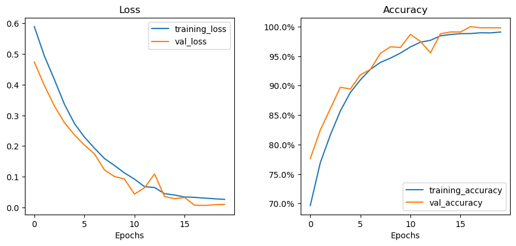
    


**Effnet Model**


```python
training_curves(effnet_b3_history)
```


    
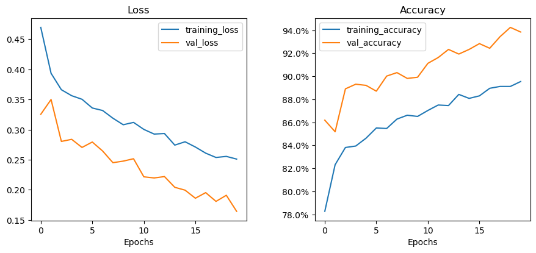
    


**Densenet Model**


```python
training_curves(densenet121_history)
```


    
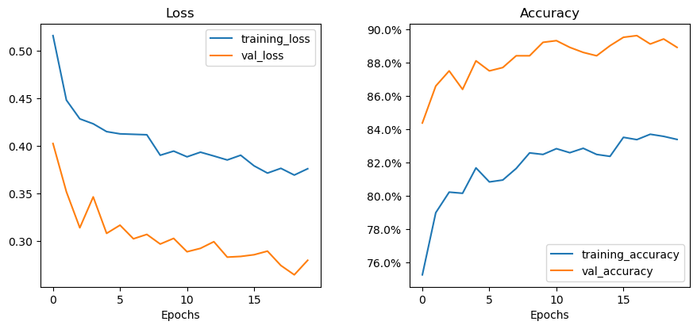
    


**ViT Model**


```python
training_curves(vit_b16_history)
```


    
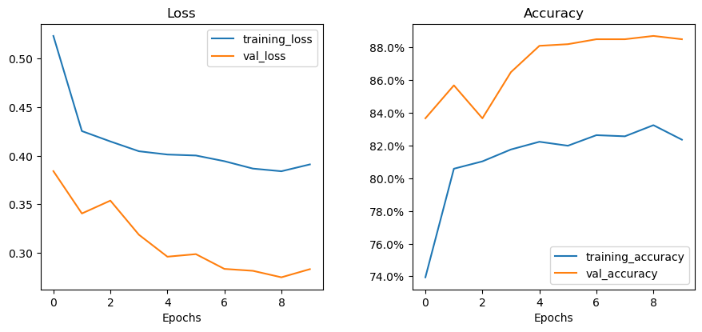
    


### Confusion Matrix

**CNN Model**


```python
show_confusion_matrix(
    test_df.label, 
    cnn_test_predictions, 
    figsize=(8, 8), 
    classes=class_names
    )
```


    
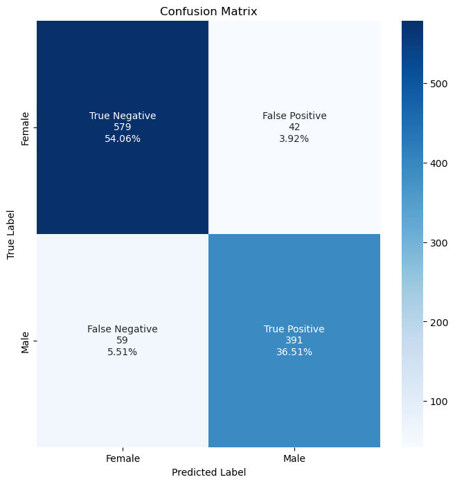
    


**Effnet Model**


```python
show_confusion_matrix(
    test_df.label, 
    effnet_b3_test_predictions, 
    figsize=(8, 8), 
    classes=class_names
    )
```


    
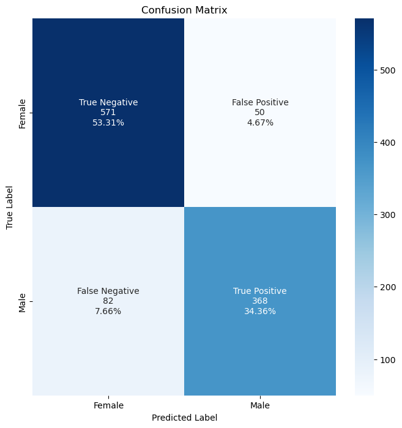
    


**Densenet Model**


```python
show_confusion_matrix(
    test_df.label, 
    densenet121_test_predictions, 
    figsize=(8, 8), 
    classes=class_names
    )
```


    
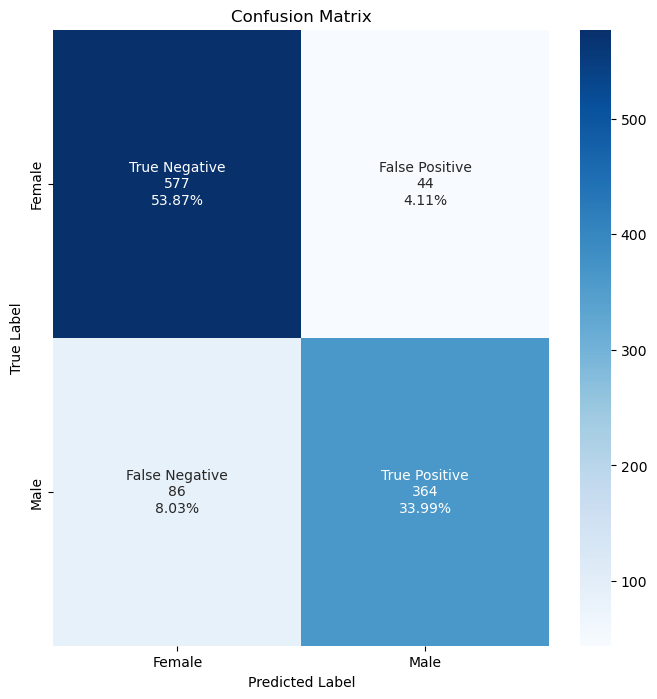
    


**ViT Model**


```python
show_confusion_matrix(
    test_df.label, 
    vit_b16_test_predictions, 
    figsize=(8, 8), 
    classes=class_names
    )
```


    
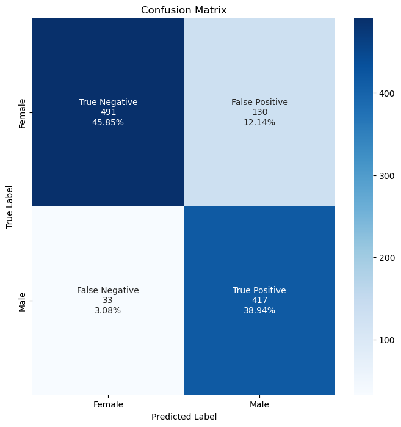
    


### Performance Scores

Performance scores we've selected to evaluate our models include:
* **Accuracy** - % of correct predictions

* **Precision** - ratio between the True Positives and all the Positives (True Positives + False Positives) (What proportion of positive identifications was actually correct?)

* **Recall** - ratio between True Positives and the sum of True Positives & False Negatives (What proportion of actual positives was identified correctly?)

* **f1 score** - harmonic mean between precision and recall

* **ROC AUC Score** - AUC measures the entire two-dimensional area underneath the entire ROC curve. AUC could be interpreted as the probability that the model ranks a random positive example more highly than a random negative example.

**CNN Model**


```python
cnn_scores = return_performance_scores(test_df.label, cnn_test_predictions, cnn_test_probabilities)
```

    Performance Metrics:
    
    =============================================
    Accuracy:	0.9057
    
    Precision:	0.9030
    
    Recall:		0.8689
    
    f1 Score:	0.8856
    
    ROC AUC Score:	0.9670
    
    

**Effnet Model**


```python
effnet_b3_scores = return_performance_scores(test_df.label, effnet_b3_test_predictions, effnet_b3_test_probabilities)
```

    Performance Metrics:
    
    =============================================
    Accuracy:	0.8768
    
    Precision:	0.8804
    
    Recall:		0.8178
    
    f1 Score:	0.8479
    
    ROC AUC Score:	0.9439
    
    

**Densenet Model**


```python
densenet121_scores = return_performance_scores(test_df.label, densenet121_test_predictions, densenet121_test_probabilities)
```

    Performance Metrics:
    
    =============================================
    Accuracy:	0.8786
    
    Precision:	0.8922
    
    Recall:		0.8089
    
    f1 Score:	0.8485
    
    ROC AUC Score:	0.9552
    
    

**ViT Model**


```python
vit_b16_scores = return_performance_scores(test_df.label, vit_b16_test_predictions, vit_b16_test_probabilities)
```

    Performance Metrics:
    
    =============================================
    Accuracy:	0.8478
    
    Precision:	0.7623
    
    Recall:		0.9267
    
    f1 Score:	0.8365
    
    ROC AUC Score:	0.9525
    
    


```python
# Record metrics with DataFrame
performance_df = pd.DataFrame({
    'CNN Model': cnn_scores,
    'Effnet Model': effnet_b3_scores,
    'Densenet Model': densenet121_scores,
    'Vision Transformer Model': vit_b16_scores
}).T

# View Performance DataFrame
performance_df
```


<div>
<style scoped>
    .dataframe tbody tr th:only-of-type {
        vertical-align: middle;
    }

    .dataframe tbody tr th {
        vertical-align: top;
    }

    .dataframe thead th {
        text-align: right;
    }
</style>
<table border="1" class="dataframe">
  <thead>
    <tr style="text-align: right;">
      <th></th>
      <th>accuracy_score</th>
      <th>precision_score</th>
      <th>recall_score</th>
      <th>f1_score</th>
      <th>ROC_AUC_score</th>
    </tr>
  </thead>
  <tbody>
    <tr>
      <th>CNN Model</th>
      <td>0.905696</td>
      <td>0.903002</td>
      <td>0.868889</td>
      <td>0.885617</td>
      <td>0.966991</td>
    </tr>
    <tr>
      <th>Effnet Model</th>
      <td>0.876751</td>
      <td>0.880383</td>
      <td>0.817778</td>
      <td>0.847926</td>
      <td>0.943908</td>
    </tr>
    <tr>
      <th>Densenet Model</th>
      <td>0.878618</td>
      <td>0.892157</td>
      <td>0.808889</td>
      <td>0.848485</td>
      <td>0.955187</td>
    </tr>
    <tr>
      <th>Vision Transformer Model</th>
      <td>0.847806</td>
      <td>0.762340</td>
      <td>0.926667</td>
      <td>0.836510</td>
      <td>0.952453</td>
    </tr>
  </tbody>
</table>
</div>


## Conclusions regarding model evaluation

- **All models have a relatively decent performance (84-90% accuracy and 0.94-0.96 ROC AUC score)**
    - However, based on research articles mentioned earlier, we should be able to obtain even better performance and reach at least 95% accuracy 
 <br>
 <br>
- **Surprisingly, accuracy of our simple CNN Model is higher than other models.**
    - However, other models have been pretrained on the imagenet dataset & we have frozen all their layers apart from the top dense layers. It's possible that these models will be able to learn meaningful differences in our images (which are much different from the imagenet dataset) after unfreezing additional layers of these models. We will check that in the next part of the notebook.
    - At the same time, further training of our simple CNN network most likely will not improve its performance without changing the architecture.
    - Also, there is a difference between test accuracy score (~90%) and training/validation accuracy scores (>99%), which means that the model may be overfitting to both training and validation data
 <br>
* **Effnet and Densenet models have similar performance scores across all metrics.**
  * Looking at learning curves of these models, its possible that their performance may improve further with more training (adding more epochs) as it doesn't look like the learning curves have stagnated throughout the training (especially effnet's accuracy have been increasing relatively steadily with each epoch)
  * Slight edits to the hyperparameters of these models could also potentially improve the performance and convergence to the best loss/accuracy combo.
 <br>
 <br>
* **Vision Transformer Model performs poorer than expected**
  * ViT we used has over 85M parameters and we trained it only for 10 epochs due to long training time.
  * Vision Transformers are known to perform better when trained on large datasets
  * Unfreezing ViT layers may improve its performance
  * Interestingly, ViT has a higher recall and lower precision compared to other models, which means that the model is generally more likely to predict the gender as male (male = 1) despite the slight class imbalance with more female labels

# Fine Tuning

We will fine tune models by retraining them after unfreezing all layers and using a decreased learning rate by a factor of 10.

We will do that for both **Efficientnet** and **Densenet** models only as doing so for the ViT might take too much computing power.

## Efficientnet


```python
#effnet_b3_model_ft = hub.KerasLayer("https://tfhub.dev/google/efficientnet/b3/classification/1", trainable = True)
#For efficient net we couldn't re-use the model we pre-trained because it's only possible to unfreeze the layers when importing the model from the hub
#That's why we're importing effnet again but setting all layers as trainable
effnet_b3_model_ft = hub.KerasLayer("gs://cloud-tpu-checkpoints/efficientnet/v2/hub/efficientnetv2-b3/classification", trainable = True)
```


```python
#defining our model with top dense layers
def efficientnet_b3_ft_seq():
    
    initializer = tf.keras.initializers.GlorotNormal(seed=CFG.seed)
    
    efficientnet_b3_ft = Sequential([
        layers.Input(shape=CFG.img_size, dtype=tf.float32, name='input_image'),
        effnet_b3_model_ft,
        layers.Dropout(0.5),
        layers.Dense(512, activation='relu', kernel_initializer=initializer),
        layers.Dense(256, activation='relu', kernel_initializer=initializer),
        layers.Dense(2, dtype=tf.float32, activation='sigmoid', kernel_initializer=initializer)
    ], name='efficientnet_b3_ft')
    
    return efficientnet_b3_ft
```


```python
model_effnet_b3_ft = efficientnet_b3_ft_seq()

model_effnet_b3_ft.summary()
```

    Model: "efficientnet_b3_ft"
    _________________________________________________________________
     Layer (type)                Output Shape              Param #   
    =================================================================
     keras_layer_1 (KerasLayer)  (None, 1000)              14467622  
                                                                     
     dropout_4 (Dropout)         (None, 1000)              0         
                                                                     
     dense_10 (Dense)            (None, 512)               512512    
                                                                     
     dense_11 (Dense)            (None, 256)               131328    
                                                                     
     dense_12 (Dense)            (None, 2)                 514       
                                                                     
    =================================================================
    Total params: 15,111,976
    Trainable params: 15,002,760
    Non-trainable params: 109,216
    _________________________________________________________________
    


```python
tf.random.set_seed(CFG.seed)

# Compile the model
model_effnet_b3_ft.compile(
    loss=tf.keras.losses.BinaryCrossentropy(),
    optimizer=tf.keras.optimizers.Adam(learning_rate=0.0001),
    metrics=METRICS
)

# Train the model
print(f'Training {model_effnet_b3_ft.name}.')
print(f'Train on {len(train_new_df)} samples \n Validate on {len(val_df)} samples')


effnet_b3_ft_history = train_model(model_effnet_b3_ft, 5, CALLBACKS, train_ds, val_ds)
```

    Training efficientnet_b3_ft.
    Train on 9631 samples 
     Validate on 963 samples
    Epoch 1/5
    271/271 [==============================] - 120s 206ms/step - loss: 0.2533 - accuracy: 0.8932 - val_loss: 0.0843 - val_accuracy: 0.9758 - lr: 1.0000e-04
    Epoch 2/5
    271/271 [==============================] - 53s 197ms/step - loss: 0.0834 - accuracy: 0.9710 - val_loss: 0.0274 - val_accuracy: 0.9899 - lr: 1.0000e-04
    Epoch 3/5
    271/271 [==============================] - 54s 197ms/step - loss: 0.0350 - accuracy: 0.9885 - val_loss: 0.0171 - val_accuracy: 0.9940 - lr: 1.0000e-04
    Epoch 4/5
    271/271 [==============================] - 54s 198ms/step - loss: 0.0215 - accuracy: 0.9923 - val_loss: 0.0142 - val_accuracy: 0.9970 - lr: 1.0000e-04
    Epoch 5/5
    271/271 [==============================] - 53s 196ms/step - loss: 0.0249 - accuracy: 0.9903 - val_loss: 0.0271 - val_accuracy: 0.9919 - lr: 1.0000e-04
    


```python
model_effnet_b3_ft.save('/kaggle/working/model_effnet_b3_ft_Apr3.h5')
```


```python
model_effnet_b3_ft.evaluate(test_ds)
```

    34/34 [==============================] - 2s 64ms/step - loss: 0.2518 - accuracy: 0.9542
    


    [0.2518484592437744, 0.9542483687400818]


```python
# model probabilities and predictions
effnet_b3_ft_test_probabilities = model_effnet_b3_ft.predict(test_ds, verbose=1)
effnet_b3_ft_test_predictions = tf.argmax(effnet_b3_ft_test_probabilities, axis=1)
```

    34/34 [==============================] - 3s 56ms/step
    


```python
effnet_b3_ft_scores = return_performance_scores(test_df.label, effnet_b3_ft_test_predictions, effnet_b3_ft_test_probabilities)
```

    Performance Metrics:
    
    =============================================
    Accuracy:	0.9542
    
    Precision:	0.9275
    
    Recall:		0.9667
    
    f1 Score:	0.9467
    
    ROC AUC Score:	0.9889
    
    


```python
show_confusion_matrix(
    test_df.label, 
    effnet_b3_ft_test_predictions, 
    figsize=(8, 8), 
    classes=class_names
    )
```


    

    


## Densenet


```python
# Call our model and freeze the layers
model_densenet121_ft1 = model_densenet121

for layer in model_densenet121_ft1.layers:
    layer.trainable = True
    print(layer)

```

    <keras.engine.functional.Functional object at 0x7f6dcecc2390>
    <keras.layers.pooling.global_average_pooling2d.GlobalAveragePooling2D object at 0x7f6dcf25a050>
    <keras.layers.regularization.dropout.Dropout object at 0x7f6dcec36750>
    <keras.layers.core.dense.Dense object at 0x7f6dcedf9e90>
    <keras.layers.core.dense.Dense object at 0x7f6dced05b90>
    <keras.layers.core.dense.Dense object at 0x7f6dcecb3050>
    


```python
# Generate Summary of the Model
model_densenet121_ft1.summary()
```

    Model: "densenet121_model_1"
    _________________________________________________________________
     Layer (type)                Output Shape              Param #   
    =================================================================
     densenet121 (Functional)    (None, 7, 7, 1024)        7037504   
                                                                     
     global_average_pooling2d (G  (None, 1024)             0         
     lobalAveragePooling2D)                                          
                                                                     
     dropout_2 (Dropout)         (None, 1024)              0         
                                                                     
     dense_5 (Dense)             (None, 1024)              1049600   
                                                                     
     dense_6 (Dense)             (None, 512)               524800    
                                                                     
     dense_7 (Dense)             (None, 2)                 1026      
                                                                     
    =================================================================
    Total params: 8,612,930
    Trainable params: 8,529,282
    Non-trainable params: 83,648
    _________________________________________________________________
    


```python
model_densenet121_ft1.compile(
    loss=tf.keras.losses.BinaryCrossentropy(),
    optimizer=tf.keras.optimizers.Adam(learning_rate=0.0001),
    metrics=METRICS
)
```


```python
densenet121_ft_history = train_model(model_densenet121_ft1, 5, CALLBACKS, train_ds, val_ds)
```

    Epoch 1/5
    271/271 [==============================] - 118s 217ms/step - loss: 0.2413 - accuracy: 0.9131 - val_loss: 0.2119 - val_accuracy: 0.9133 - lr: 1.0000e-04
    Epoch 2/5
    271/271 [==============================] - 55s 205ms/step - loss: 0.0885 - accuracy: 0.9707 - val_loss: 0.0539 - val_accuracy: 0.9869 - lr: 1.0000e-04
    Epoch 3/5
    271/271 [==============================] - 56s 205ms/step - loss: 0.0399 - accuracy: 0.9866 - val_loss: 0.0461 - val_accuracy: 0.9808 - lr: 1.0000e-04
    Epoch 4/5
    271/271 [==============================] - 56s 205ms/step - loss: 0.0302 - accuracy: 0.9901 - val_loss: 0.0467 - val_accuracy: 0.9829 - lr: 1.0000e-04
    Epoch 5/5
    271/271 [==============================] - 56s 205ms/step - loss: 0.0328 - accuracy: 0.9881 - val_loss: 0.0124 - val_accuracy: 0.9980 - lr: 1.0000e-04
    


```python
# Save the model
model_densenet121_ft1.save('/kaggle/working/model_densenet121_ft_Apr3.h5')
```


```python
model_densenet121_ft1.evaluate(test_ds)
```

    34/34 [==============================] - 2s 62ms/step - loss: 0.1455 - accuracy: 0.9711
    


    [0.14546559751033783, 0.9710550904273987]


```python
# model probabilities and predictions
densenet121_ft_test_probabilities = model_densenet121_ft1.predict(test_ds, verbose=1)
densenet121_ft_test_predictions = tf.argmax(densenet121_ft_test_probabilities, axis=1)
```

    34/34 [==============================] - 5s 59ms/step
    


```python
densenet121_ft_scores = return_performance_scores(test_df.label, densenet121_ft_test_predictions, densenet121_ft_test_probabilities)
```

    Performance Metrics:
    
    =============================================
    Accuracy:	0.9711
    
    Precision:	0.9544
    
    Recall:		0.9778
    
    f1 Score:	0.9660
    
    ROC AUC Score:	0.9943
    
    


```python
show_confusion_matrix(
    test_df.label, 
    densenet121_ft_test_predictions, 
    figsize=(8, 8), 
    classes=class_names
    )
```


    
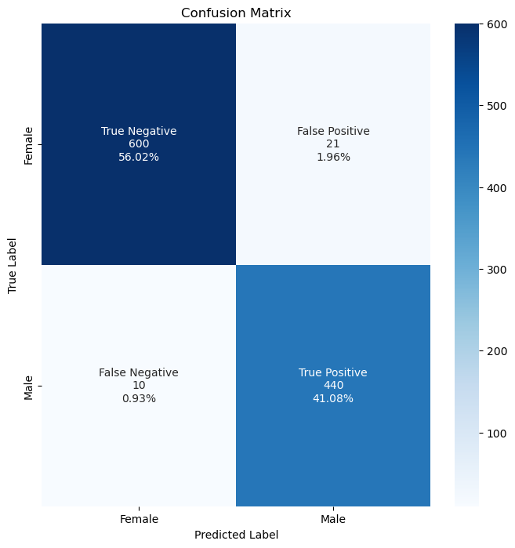
    


```python
# Record metrics with DataFrame
performance_ft_df = pd.DataFrame({
    'CNN Model': cnn_scores,
    'Vision Transformer Model': vit_b16_scores,
    'Effnet Model': effnet_b3_scores,
    'Effnet Model Fine Tuned': effnet_b3_ft_scores,
    'Densenet Model': densenet121_scores,
    'Densenet Model Fine Tuned': densenet121_ft_scores
    
}).T

# View Performance DataFrame
performance_ft_df
```


<div>
<style scoped>
    .dataframe tbody tr th:only-of-type {
        vertical-align: middle;
    }

    .dataframe tbody tr th {
        vertical-align: top;
    }

    .dataframe thead th {
        text-align: right;
    }
</style>
<table border="1" class="dataframe">
  <thead>
    <tr style="text-align: right;">
      <th></th>
      <th>accuracy_score</th>
      <th>precision_score</th>
      <th>recall_score</th>
      <th>f1_score</th>
      <th>ROC_AUC_score</th>
    </tr>
  </thead>
  <tbody>
    <tr>
      <th>CNN Model</th>
      <td>0.905696</td>
      <td>0.903002</td>
      <td>0.868889</td>
      <td>0.885617</td>
      <td>0.966991</td>
    </tr>
    <tr>
      <th>Vision Transformer Model</th>
      <td>0.847806</td>
      <td>0.762340</td>
      <td>0.926667</td>
      <td>0.836510</td>
      <td>0.952453</td>
    </tr>
    <tr>
      <th>Effnet Model</th>
      <td>0.876751</td>
      <td>0.880383</td>
      <td>0.817778</td>
      <td>0.847926</td>
      <td>0.943908</td>
    </tr>
    <tr>
      <th>Effnet Model Fine Tuned</th>
      <td>0.954248</td>
      <td>0.927505</td>
      <td>0.966667</td>
      <td>0.946681</td>
      <td>0.988892</td>
    </tr>
    <tr>
      <th>Densenet Model</th>
      <td>0.878618</td>
      <td>0.892157</td>
      <td>0.808889</td>
      <td>0.848485</td>
      <td>0.955187</td>
    </tr>
    <tr>
      <th>Densenet Model Fine Tuned</th>
      <td>0.971055</td>
      <td>0.954447</td>
      <td>0.977778</td>
      <td>0.965971</td>
      <td>0.994325</td>
    </tr>
  </tbody>
</table>
</div>


## Conclusions

* As expected, **fine tuned versions of Efficientnet and Densenet models significantly outperform their versions that were trained with all their layers frozen**
  * Both models trained very quickly (5 epochs) to an acceptable level and are prone to overfitting after layers have been unfrozen due to the large amount of trainable parameters (even with a 0.5 dropout layer)
<br>
<br>
* **Fine tuned Densenet121 model performs very well with 97% accuracy on test set and ROC AUC score of 0.994**
  * Architecture that performed very well in a paper to distinguish gender based on panoramic dental x-rays also performs well in our case, which shows that it's important to do research before trying out a large amount of available models
<br>
<br>

**I decided to create a submission for the kaggle competition using the fine tuned densenet121 model**
* I trained the model for additional few epochs before submitting
* Performance on 40% of 11.7k images in test data that had no provided labels is a little bit worse (0.987 ROC AUC) than performance on our smaller test set (0.994 ROC AUC Score)
* However the result is decent and the submission ended up having **8th rank out of 36 teams** in the competition as of around 1st of April 2023 (see capture below)
<br>
<br>

**Ideas to further improve the performance of our model:**
* **Try other architectures & hyperparameters**
  * We've tried a relatively small subset of models and their hyperparameters. There are opportunities to modify various hyperparameters related to these models such as sizes of dense layers, learning rates, additional regularization methods, different optimizers (e.g., SGD). 
  * We could also try different architectures (e.g., maybe densenet169 will perform better than densenet121, etc.)
  * Check how these models behave if we oversample from the minority class (Female) or undersample from the majority class (Male) to even out the class distribution
  * This will require a lot od computational power to train all these different versions of the models
<br>
<br>
* **Analyze miscategorized labels in more detail**
  * Check whether there are any trends in miscategorized images to understand if there is anything that could be done to data preprocessing to address these issues
<br>
<br>
* **Use ensembling methods**
  * We could use ensembling methods, which combine outputs of several base models via averaging to obtain final prediction
  * This could help with having less model-level variance in predictions and is another form of regularizing the results


## (Optional) Creating the kaggle submission


```python
# In the future, whenever we need the model, we can load it like this:
# load model
model_densenet121_ft1 = load_model('/kaggle/working/model_31march.h5')
```


```python
# test_files = glob(test_folder + "/*.png")
# test_gender_csv = '/kaggle/input/spr-x-ray-age-and-gender-dataset/sample_submission_gender.csv'
# df_gender = pd.read_csv(test_gender_csv)
# test_df=build_df(test_files)
# test_df["gender"] = ['male' if x == 1 else 'female' for x in test_df['label']]
# test_df.head(5)
```


<div>
<style scoped>
    .dataframe tbody tr th:only-of-type {
        vertical-align: middle;
    }

    .dataframe tbody tr th {
        vertical-align: top;
    }

    .dataframe thead th {
        text-align: right;
    }
</style>
<table border="1" class="dataframe">
  <thead>
    <tr style="text-align: right;">
      <th></th>
      <th>image_path</th>
      <th>label</th>
      <th>gender</th>
    </tr>
  </thead>
  <tbody>
    <tr>
      <th>0</th>
      <td>/kaggle/input/spr-x-ray-age-and-gender-dataset...</td>
      <td>0.5</td>
      <td>female</td>
    </tr>
    <tr>
      <th>1</th>
      <td>/kaggle/input/spr-x-ray-age-and-gender-dataset...</td>
      <td>0.5</td>
      <td>female</td>
    </tr>
    <tr>
      <th>2</th>
      <td>/kaggle/input/spr-x-ray-age-and-gender-dataset...</td>
      <td>0.5</td>
      <td>female</td>
    </tr>
    <tr>
      <th>3</th>
      <td>/kaggle/input/spr-x-ray-age-and-gender-dataset...</td>
      <td>0.5</td>
      <td>female</td>
    </tr>
    <tr>
      <th>4</th>
      <td>/kaggle/input/spr-x-ray-age-and-gender-dataset...</td>
      <td>0.5</td>
      <td>female</td>
    </tr>
  </tbody>
</table>
</div>


```python
# # generate test input pipeline
# real_test_ds = create_pipeline(test_df, load_image, augmentation = False, prefetch = False)

```


```python
# # model probabilities and predictions
# model_densenet121_ft1_submission_probabilities = model_densenet121_ft1.predict(real_test_ds, verbose=1)
# model_densenet121_ft1_submission_predictions = tf.argmax(model_densenet121_ft1_submission_probabilities, axis=1)
```

    368/368 [==============================] - 239s 632ms/step
    


```python
# probabilities = [element[1] for element in model_densenet121_ft1_submission_probabilities]
```


```python
# submission = pd.DataFrame(
#     {'imageId': test_df["image_path"].map(get_id),
#      'gender': probabilities
#     }

#     )
```


```python
# submission
```


<div>
<style scoped>
    .dataframe tbody tr th:only-of-type {
        vertical-align: middle;
    }

    .dataframe tbody tr th {
        vertical-align: top;
    }

    .dataframe thead th {
        text-align: right;
    }
</style>
<table border="1" class="dataframe">
  <thead>
    <tr style="text-align: right;">
      <th></th>
      <th>imageId</th>
      <th>gender</th>
    </tr>
  </thead>
  <tbody>
    <tr>
      <th>0</th>
      <td>005084</td>
      <td>1.000000e+00</td>
    </tr>
    <tr>
      <th>1</th>
      <td>003065</td>
      <td>4.035029e-04</td>
    </tr>
    <tr>
      <th>2</th>
      <td>010841</td>
      <td>3.478469e-10</td>
    </tr>
    <tr>
      <th>3</th>
      <td>008174</td>
      <td>5.857697e-13</td>
    </tr>
    <tr>
      <th>4</th>
      <td>003741</td>
      <td>9.998453e-01</td>
    </tr>
    <tr>
      <th>...</th>
      <td>...</td>
      <td>...</td>
    </tr>
    <tr>
      <th>11742</th>
      <td>006247</td>
      <td>1.000000e+00</td>
    </tr>
    <tr>
      <th>11743</th>
      <td>001687</td>
      <td>7.917080e-05</td>
    </tr>
    <tr>
      <th>11744</th>
      <td>005525</td>
      <td>9.999999e-01</td>
    </tr>
    <tr>
      <th>11745</th>
      <td>010839</td>
      <td>1.000000e+00</td>
    </tr>
    <tr>
      <th>11746</th>
      <td>001359</td>
      <td>1.000000e+00</td>
    </tr>
  </tbody>
</table>
<p>11747 rows × 2 columns</p>
</div>


```python
# submission.to_csv('submission.csv',index=False)
```


